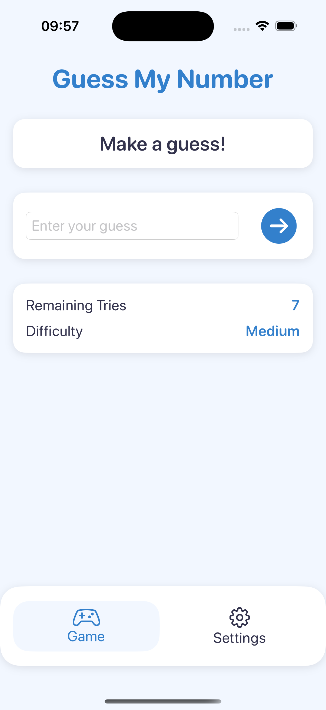

# GuessMyNumber

**GuessMyNumber** is an iOS application written in Swift that challenges users to guess a secret number in as few attempts as possible. This repository contains the source code, documentation, and resources needed to build and run the app.

---

## Features
- Multiple Difficulty Levels: Choose from easy, medium, or hard modes.
- User-Friendly Interface: Intuitive design for both new and experienced players.
- Progress Tracking: Displays the number of guesses, offering quick feedback for each attempt.
- SwiftUI: Built with SwiftUI for a modern, reactive user interface.

---

## Project Structure
- GuessMyNumber: Contains the Swift source code organised by feature (Models, Views, ViewModel, Utilities).
- GuessMyNumber.xcodeproj: The Xcode project file.
- docs: Documentation files and UI mock-ups for reference.

---

## UI Screens
### Welcome Screen
Shows the initial screen of the app.

### Game Screen
Illustrates the main area where the user enters guesses to identify the secret number.

### Settings Screen
Displays configuration options, including difficulty levels and other preferences.

### Endgame Screen
Presents the final outcome, whether victory or defeat, and offers the option to start a new game.

---

### Author
Pedro Rodrigues
"""

